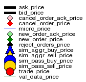

# Legend

Here is a legend of the plot points to expect within a plot: 

Note that the plotter can plot both "sim" and "prod" fills on the same plot. The only difference is the color of the plot points. 

To enable the legend in the plotter, set the flag in the constructor. Default is turned off. 

## Interpretation 

Here are what these plot points mean: 

### Quote & Trade Data

- **ask price**: Top-of-book (TOB), "level 1" price of the best offer in the order book. 
- **bid price**: Top-of-book (TOB), "level 1" price of the best bid in the order book. 
- **micro price**: The "instanteous" price of the asset. Depends on your philosophy: is this "inverse weighted average"? is this "mid price"? Dealer's choice. 
- **trade price**: The price of a market trade event or "match" between a market maker and taker. 

### System Data 

- **val price**: The "valuation" or fair value or predicted future value of the asset at any given time. Subjective. 
- **cancel order price**: The price of a cancellation order sent to the exchange. 
- **cancel order ack**: The acknowledgement or "ack" from the exchange of a cancellation request. 
- **new order price**: The price of a new order sent to the exchange. 
- **new order ack**: The acknowledgement or "ack" from the exchange of a new order request. 
- **order reject**: The rejection of a request (new, cancel, modify) of an order request. You probably got filled when you didn't want to. 
- **aggressive buy price**: The price at which the system was filled for an "aggressive" buy order (i.e. you are the taker). 
- **aggressive sell price**: The price at which the system was filled for an "aggressive" sell order (i.e. you are the taker). 
- **passive buy price**: The price at which the system was filled for a "passive" buy order (i.e. you are the market maker). 
- **passive sell price**: The price at which the system was filled for a "passive" sell order (i.e. you are the market maker). 